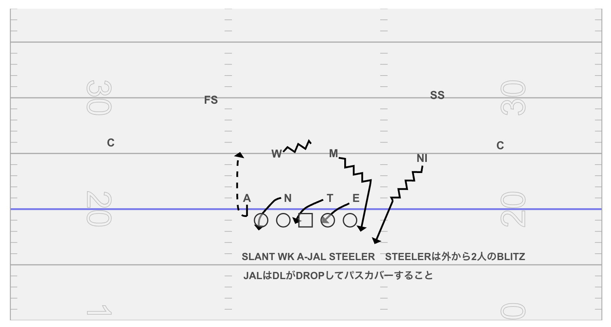
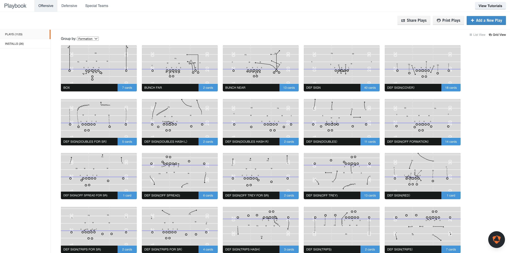

# Football Canvas

アメリカンフットボールのサインを簡単に作成できるデスクトップアプリケーションです。直感的なインターフェースで、プレイの戦略やサインを視覚的に表現できます。

## 🏈 特徴

- **ドラッグ&ドロップ操作**: プレイヤーやボールを簡単に配置
- **豊富なアイコン**: ◯、三角、四角、文字でプレイヤーを表現
- **フィールドのカスタマイズ**: アメリカンフットボールフィールドの背景と色設定
- **多彩な矢印描画**: 直線、曲線、ジグザグ、点線から選択可能
- **テキスト注釈**: プレイの説明やサインをテキストで追加
- **プレイ管理**: 作成したサインの保存・読み込み・整理
- **プレイリスト機能**: 複数のプレイをまとめて管理
- **エクスポート機能**: 画像保存・印刷対応
- **オフライン対応**: インターネット接続不要で動作

## 🖼️ スクリーンショット

### メインキャンバス


### プレイ一覧


## 📋 システム要件

- **Windows**: Windows 10以降
- **macOS**: macOS 10.15以降
- **メモリ**: 4GB RAM以上推奨
- **ストレージ**: 200MB以上の空き容量
- **インターネット接続**: 初回インストール時のみ必要

## 🚀 インストール方法

### 前提条件

以下のソフトウェアがインストールされている必要があります：

- [Node.js](https://nodejs.org/) (v18.0.0以降)
- [npm](https://www.npmjs.com/) (Node.jsに同梱)

### 開発環境のセットアップ

1. **リポジトリのクローン**
   ```bash
   git clone <repository-url>
   cd playCanvas
   ```

2. **依存関係のインストール**
   ```bash
   npm install
   ```

3. **アプリケーションの起動**
   ```bash
   npm run dev
   ```

### プロダクションビルド

1. **アプリケーションのビルド**
   ```bash
   npm run build
   ```

2. **Electronアプリケーションのパッケージ化**
   ```bash
   npm run electron:build
   ```

## 🛠️ 開発用コマンド

| コマンド | 説明 |
|---------|------|
| `npm run dev` | 開発サーバーの起動 |
| `npm run build` | プロダクションビルド |
| `npm run preview` | ビルド結果のプレビュー |
| `npm run electron:dev` | Electron開発モード |
| `npm run electron:build` | Electronアプリのビルド |
| `npm run typecheck` | TypeScript型チェック |
| `npm run lint` | ESLintによるコード検査 |

## 🎮 使用方法

### 基本操作

1. **新しいプレイの作成**
   - ヘッダーの「新しいプレイ」ボタンをクリック

2. **プレイヤーの配置**
   - サイドバーから「プレイヤー」ツールを選択
   - チーム（オフェンス/ディフェンス）を選択
   - アイコンの種類を選択
   - キャンバス上でクリックして配置

3. **矢印の描画**
   - サイドバーから「矢印」ツールを選択
   - 線の種類と矢印の形を設定
   - キャンバス上でドラッグして描画

4. **テキストの追加**
   - サイドバーから「テキスト」ツールを選択
   - フォントとサイズを設定
   - キャンバス上でクリックしてテキストを配置

### プレイの管理

1. **保存**
   - ヘッダーの「保存」ボタンで現在のプレイを保存
   - 「名前を付けて保存」で新しいプレイとして保存

2. **プレイ一覧**
   - サイドバーの「プレイ一覧」タブで過去のプレイを表示
   - 検索・フィルター機能で目的のプレイを見つける

3. **プレイリスト**
   - サイドバーの「プレイリスト」タブでプレイをグループ化
   - ドラッグ&ドロップで順序を変更

### エクスポート

1. **画像として保存**
   - ヘッダーの「エクスポート」ボタンでPNG形式で保存

2. **印刷**
   - ヘッダーの「印刷」ボタンで印刷プレビューを表示

## 🏗️ 技術スタック

- **フロントエンド**: React 18 + TypeScript
- **デスクトップ**: Electron 27
- **キャンバス描画**: Konva.js + React-Konva
- **スタイリング**: Tailwind CSS
- **ビルドツール**: Vite
- **データ永続化**: localStorage

## 📁 プロジェクト構造

```
playCanvas/
├── src/
│   ├── components/          # Reactコンポーネント
│   │   ├── Header.tsx      # ヘッダーコンポーネント
│   │   ├── Sidebar.tsx     # サイドバーコンポーネント
│   │   ├── CanvasArea.tsx  # キャンバスエリア
│   │   ├── FootballCanvas.tsx # メインキャンバス
│   │   ├── PlayListView.tsx   # プレイ一覧
│   │   ├── PlaylistManager.tsx # プレイリスト管理
│   │   └── PlaylistEditor.tsx  # プレイリスト編集
│   ├── types/              # TypeScript型定義
│   │   └── index.ts
│   ├── utils/              # ユーティリティ関数
│   │   └── storage.ts      # データ永続化
│   ├── App.tsx             # メインアプリケーション
│   └── main.tsx            # エントリーポイント
├── docs/                   # ドキュメント
│   ├── design.md          # 設計仕様書
│   └── images/            # スクリーンショット
├── electron/               # Electronメイン関連
├── package.json           # npm設定
├── tsconfig.json         # TypeScript設定
├── tailwind.config.js    # Tailwind設定
├── vite.config.ts        # Vite設定
└── README.md            # このファイル
```

## 🔧 設定

### 環境変数

開発時に使用可能な環境変数：

```bash
# 開発モード
NODE_ENV=development

# ポート番号（デフォルト: 5173）
PORT=5173
```

### アプリケーション設定

アプリケーションの設定は以下の場所に保存されます：

- **Windows**: `%APPDATA%/football-canvas/`
- **macOS**: `~/Library/Application Support/football-canvas/`
- **Linux**: `~/.config/football-canvas/`

## 🐛 トラブルシューティング

### よくある問題

1. **npm install でエラーが発生する**
   ```bash
   # キャッシュをクリアして再実行
   npm cache clean --force
   npm install
   ```

2. **Electronアプリが起動しない**
   ```bash
   # 依存関係を再インストール
   rm -rf node_modules package-lock.json
   npm install
   ```

3. **型エラーが発生する**
   ```bash
   # 型チェックを実行
   npm run typecheck
   ```

4. **ビルドが失敗する**
   ```bash
   # プロジェクトをクリーンして再ビルド
   npm run clean
   npm run build
   ```

### パフォーマンスの最適化

- プレイが多くなると動作が重くなる場合は、古いプレイを削除してください
- 大きなキャンバスサイズは描画性能に影響します
- ブラウザのハードウェアアクセラレーションを有効にしてください

## 🤝 コントリビューション

1. フォークを作成
2. フィーチャーブランチを作成 (`git checkout -b feature/AmazingFeature`)
3. 変更をコミット (`git commit -m 'Add some AmazingFeature'`)
4. ブランチにプッシュ (`git push origin feature/AmazingFeature`)
5. プルリクエストを作成

## 📝 ライセンス

このプロジェクトはMITライセンスの下で公開されています。詳細は [LICENSE](LICENSE) ファイルを参照してください。

## 👥 開発者

- **開発**: Claude Code AI Assistant
- **プロジェクト管理**: ずんだもん

## 📞 サポート

問題や質問がある場合は、以下の方法でお問い合わせください：

- **GitHub Issues**: バグ報告や機能要望
- **Email**: support@football-canvas.app
- **Wiki**: [プロジェクトWiki](../../wiki) で詳細なドキュメントを確認

---

**注意**: このアプリケーションは教育・トレーニング目的で作成されています。商用利用については別途ライセンスが必要な場合があります。